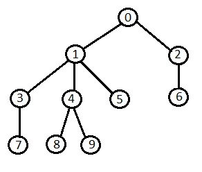

## DFS

In a depth first search, you start at the root, and follow one of the branches of the tree as far as possible until either the node you are looking for is found or you hit a leaf node ( a node with no children). If you hit a leaf node, then you continue the search at the nearest ancestor with unexplored children.

### BFS

In a breadth first search, you start at the root node, and then scan each node in the first level starting from the leftmost node, moving towards the right. Then you continue scanning the second level (starting from the left) and the third level, and so on until you’ve scanned all the nodes, or until you find the actual node that you were searching for. In a BFS, when traversing one level, we need some way of knowing which nodes to traverse once we get to the next level. The way this is done is by storing the pointers to a level’s child nodes while searching that level. The pointers are stored in FIFO (First-In-First-Out) queue. This, in turn, means that BFS uses a large amount of memory because we have to store the pointers.



```ts
/**
 * Tree node representation
 *
 * @class TreeNode
 */
class TreeNode {
  label: number;
  data: number;

  /**
   * Creates an instance of TreeNode.
   * @param {number} label
   * @param {number} data
   */
  constructor(label: number, data: number){
    this.label = label;
    this.data = data;
  }
}

/**
 * Tree representation
 *
 * @class Tree
 */
class Tree {
  // The root of a the tree
  root: TreeNode
  // We use adjacency list to for BFS/DFS, we keep only the labels here
  // not the actual nodes
  adjacencies: Array<Array<number>>
  // Array of the nodes
  nodes: Array<TreeNode>
  // Allow a node to be connected with itself, cyclic graph
  allowCyclic: boolean

  constructor(rootValue: number, allowCyclic: boolean = false) {
    this.root = new TreeNode(0, rootValue);
    this.adjacencies = [];
    this.adjacencies[0] = [];
    this.nodes = [];
    this.allowCyclic = allowCyclic;
  }

  /**
   * Add a node to the tree
   *
   * @param {TreeNode} node
   */
  addNode(node: TreeNode){
    this.adjacencies[node.label] = [];
    this.nodes.push(node);
  }

  /**
   * Set a connection between two nodes
   *
   * @param {number} node1
   * @param {number} node2
   */
  setConnection(node1Label: number, node2Label: number){
    if(!this.allowCyclic && node1Label === node2Label) throw Error('Graph cannot be cyclic');
    this.adjacencies[node1Label].push(node2Label);
  }

  /**
   * Breath first search
   *
   * @param {Function} [cb]
   * @returns {array}
   */
  breadthFirstSearch(cb?: Function){
    const visitedNodes : Array<number> = [];
    let nodesToProcess : Array<number> = [0];

    while(nodesToProcess.length){
      const node = nodesToProcess.shift();

      // process the node if there is a callback
      if(cb){
        const result = cb(node, visitedNodes, nodesToProcess);
        if(result === true) break;
      }

      if(!(visitedNodes.indexOf(node) > -1)){
        nodesToProcess = nodesToProcess.concat(this.adjacencies[node]);
        visitedNodes.push(node);
      }
    }

    return visitedNodes;
  }

  /**
   * Depth first search
   *
   * @param {Function} [cb]
   * @returns {array}
   */
  depthFirstSearch(cb?: Function){
    const visitedNodes : Array<number> = [];
    let nodesToProcess : Array<number> = [0]

    while(nodesToProcess.length){
      let node = nodesToProcess.shift();

      // process the node if there is a callback
      if(cb){
        const result = cb(node, visitedNodes, nodesToProcess);
        if(result === true) break;
      }

      if(!(visitedNodes.indexOf(node) > -1)){
        visitedNodes.push(node);
        if(!this.adjacencies[node]) continue;
        nodesToProcess = this.adjacencies[node].concat(nodesToProcess);
      }
    }

    return visitedNodes;
  }
}


const tree = new Tree(100);
const node1 = new TreeNode(1, 99);
const node2 = new TreeNode(2, 3);
const node3 = new TreeNode(3, 19);
const node4 = new TreeNode(4, -20);
const node5 = new TreeNode(5, 33);
const node6 = new TreeNode(6, 3663);
const node7 = new TreeNode(7, 3663);
const node8 = new TreeNode(8, 3663);
const node9 = new TreeNode(9, 3663);
tree.addNode(node1);
tree.addNode(node2);
tree.addNode(node3);
tree.addNode(node4);
tree.addNode(node5);
tree.addNode(node6);
tree.addNode(node7);
tree.addNode(node8);
tree.addNode(node9);
tree.setConnection(0, 1);
tree.setConnection(0, 2);
tree.setConnection(2, 6);
tree.setConnection(1, 3);
tree.setConnection(1, 4);
tree.setConnection(1, 5);
tree.setConnection(3, 7);
tree.setConnection(4, 8);
tree.setConnection(4, 9);

console.assert(JSON.stringify(tree.breadthFirstSearch()) === '[0,1,2,3,4,5,6,7,8,9]', 'BFS Wrong implementation');

console.assert(JSON.stringify(tree.depthFirstSearch) === '[0,1,3,7,4,8,9,5,2,6]', 'DFS Wrong Implementation');
```