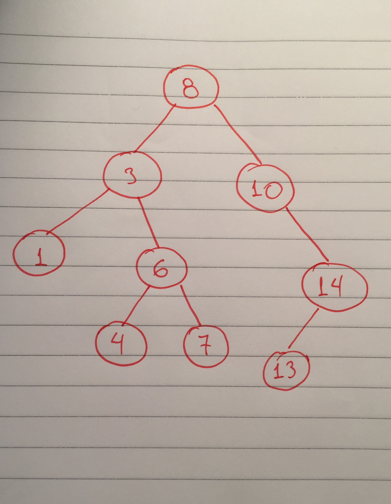

## Tree Representation



```ts
interface MyNode {
  value: number;
  parent?: MyNode;
  left?: MyNode;
  right?: MyNode;
}

const node13: MyNode = { value: 13, left: undefined, right: undefined };
const node14: MyNode = { value: 14, left: node13, right: undefined };
const node7: MyNode = { value: 7, left: undefined, right: undefined };
const node4: MyNode = { value: 4, left: undefined, right: undefined };
const node6: MyNode = { value: 6, left: node4, right: node7 };
const node1: MyNode = { value: 1, left: undefined, right: undefined };
const node3: MyNode = { value: 3, left: node1, right: node6 };
const node10: MyNode = { value: 10, left: undefined, right: node14 };
const root: MyNode = { value: 8, parent: undefined, left: node3, right: node10 };

const createTree = function(): MyNode{
  root.parent = undefined;
  node10.parent = root;
  node3.parent = root;
  node1.parent = node3;
  node6.parent = node3;
  node4.parent = node6;
  node7.parent = node6;
  node14.parent = node10;
  node13.parent = node14;

  return root;
}
```

### Pre-Order Traversal

The root of the binary tree is visited first, then its left children and finally its right children. Pre-Order Traversal is a DFS traversal.

For the tree of the image the order should be:

`8 -> 3 -> 1 -> 6 -> 4 -> 7 -> 10 -> 14 -> 13`

#### Implementantation


```ts
/**
 * Pre-order traversal
 *
 * @param {MyNode} node
 * @param {Function} cb
 * @returns
 */
const preOrderTraversal = function(node: MyNode, cb: Function){
  if(!node) return;
  cb(node);
  preOrderTraversal(node.left, cb);
  preOrderTraversal(node.right, cb);
}

preOrderTraversal(createTree(), node => console.log(node.value));
```

### In-Order Traversal

The left child of the tree is visited first. Then the root and at the end the right child. In-Order Traversal is a DFS traversal.

For the tree of the image the order should be:

`1 -> 3 -> 4 -> 6 -> 7 -> 8 -> 10 -> 13 -> 14`

```ts
/**
 * In-order traversal
 *
 * @param {MyNode} node
 * @param {Function} cb
 * @returns
 */
const inOrderTraversal = function(node: MyNode, cb: Function){
  if(!node) return;
  inOrderTraversal(node.left, cb);
  cb(node);
  inOrderTraversal(node.right, cb);
}

inOrderTraversal(createTree(), node => console.log(node.value));
```

### Post-Order Traversal

Left children are visited first. Then the right children, and finally the root.
Post-Order Traversal is a DFS traversal.

For the tree of the image the order should be:

`1 -> 4 -> 7 -> 6 -> 3 -> 13 -> 14 -> 10 -> 8`

```ts
/**
 * Post-order traversal
 *
 * @param {MyNode} node
 * @param {Function} cb
 * @returns
 */
const postOrderTraversal = function(node: MyNode, cb: Function){
  if(!node) return;
  postOrderTraversal(node.left, cb);
  postOrderTraversal(node.right, cb);
  cb(node);
}

postOrderTraversal(createTree(), node => console.log(node.value));
```
