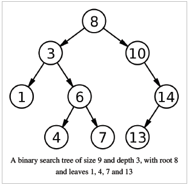

### Write functions to:

1. Find the path to a node in a balanced tree
2. Insert a new node to the tree
3. Traverse the tree



### Solution

```js
// Tree representation
const value13 = { value: 13, left: undefined, right: undefined};
const value14 = { value: 14, left: value13, right: undefined};
const value7 = { value: 7, left: undefined, right: undefined};
const value4 = { value: 4, left: undefined, right: undefined};
const value6 = { value: 6, left: value4, right: value7};
const value1 = { value: 1, left: undefined, right: undefined};
const value3 = { value: 3, left: value1, right: value6 };
const value10 = { value: 10, left: undefined, right: value14 };
const root = { value: 8, left: value3, right: value10 };


const findPath = function(root, value){
  if(!root || !root.value) throw Error('Tree is empty');
  this.path = this.path || {};
  this.path[`${value}`] = this.path[`${value}`] || [];
  this.path[`${value}`].push(root.value);

  if(root.value === value) {
    return this.path[`${value}`];
  } else {
    if(value > root.value) findPath(root.right, value);
    else if (value < root.value) findPath(root.left, value);
  }

  return this.path[`${value}`];
}

const find = function(root, value){
  if(!root || !root.value) throw Error('Tree is empty');

  if(root.value === value) {
    return root;
  } else {
    if(value > root.value) find(root.right, value);
    else if (value < root.value) fin(root.left, value);
  }

  return root;
}

const insert = function(root, value){
  if (value > root.value){
    if(root.right === undefined){
      root.right = { value: value, left: undefined, right: undefined };
    } else {
      insert(root.right, value);
    }
  } else if(value < root.value){
    if(root.left === undefined){
      root.left = { value: value, left: undefined, right: undefined };
    } else {
      insert(root.left, value);
    }
  }
  return root;
}


const traverse = function(root, cb){
  if(root && root.value){
    cb(root.value);
    traverse(root.right, cb);
    traverse(root.left, cb);
  }
}

const findMin = function(root){
  if(root.left) return findMin(root.left)
  else return root.value;
}

const findMax = function(root){
  if(root.right) return findMax(root.right)
  else return root.value;
}

const findParentOfToBeDeletedNode = function(root, value){
 let node;
 const cb = (root) => {
   if(root && ((root.right && root.right.value === value)||(root.left && root.left.value === value)))
   node = root;
  }
 traverse(root, cb)
 return node;
}

const findNode = function(root, value){
  let node;
  const cb = (root) => {
    if(root.value === value){
      node = root;
    }
  }
 traverse(root, cb)
 return node;
}

const deleteNode = function(root, value){
  let parent = findParentOfToBeDeletedNode(root, value);
  let node = findNode(root, value);

  // leaves
  if(node.left === undefined && node.right === undefined){
    if(parent.left.value === node.value){
      parent.left = undefined;
    } else if(parent.right.value === node.value){
      parent.right = undefined;
    }
  } // node with 1 child
  else if (node.left === undefined && node.right !== undefined){
    parent.right = node.right;
  } // node with 1 child
  else if (node.left !== undefined && node.right === undefined){
    parent.left = node.left;
  } // node with 2 children
  else if (node.left && node.right){
    // find the min  in the subtree
    // and swap it with the value that would be deleted
    let min = node.left.value;
    let pointer = node;
    while(pointer){
      min = pointer.value;
      pointer = pointer.left
    }
    node.value = min;

    // Delete the dublicate
    pointer = node;
    while(pointer){
      if(pointer.left && pointer.left.value === min){
        pointer.left = undefined;
      }
      pointer = pointer.left
    }

  }
}

```