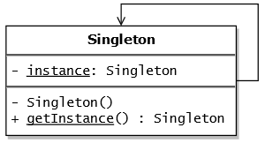

# Singleton Pattern

</img>

In software engineering, the singleton pattern is a software design pattern that restricts the instantiation of a class to one object. This is useful when exactly one object is needed to coordinate actions across the system. The concept is sometimes generalized to systems that operate more efficiently when only one object exists. <a href="https://en.wikipedia.org/wiki/Singleton_pattern">Wikipedia</a>

## Motivation

Sometimes it's important to have only one instance for a class. For example, in a system there should be only one window manager (or only a file system or only a print spooler). Usually singletons are used for centralized management of internal or external resources and they provide a global point of access to themselves.

The singleton pattern is one of the simplest design patterns: it involves only one class which is responsible to instantiate itself, to make sure it creates not more than one instance; in the same time it provides a global point of access to that instance. In this case the same instance can be used from everywhere, being impossible to invoke directly the constructor each time. <a href="http://www.oodesign.com/singleton-pattern.html">oodesign</a>

## Intent

- Ensure that only one instance of a class is created.
- Provide a global point of access to the object.

## Implementation in Typescript

### Using function

```ts
const Singleton = (function() {
  let instance;

  let init = function(value: number) {
    this.instanceID = value;
    this.getInstance = () => instance;
    return this;
  };


  return function(value: number) {
    if (instance) return instance;
    instance = init(value);
    return instance;
  };
})();

const object1 = new Singleton(10);
const object2 = new Singleton(30);
const object3 = new Singleton(15);
const object4 = new Singleton(20);

console.assert(object1.instanceID === object2.instanceID, 'Wrong implementation');
console.assert(object1.instanceID === object3.instanceID, 'Wrong implementation');
console.assert(object1.instanceID === object4.instanceID, 'Wrong implementation');
console.assert(object4.instanceID === object3.instanceID, 'Wrong implementation');
```

### Using class

```ts
/**
 * SingletonClass Simple Implementation
 *
 * @class SingletonClass
 */
class SingletonClass {
  static instance: SingletonClass = undefined;
  instanceID: number;

  /**
   * Initialize single object
   *
   * @param {number} value
   * @returns {SingletonClass}
   */
  init(value: number) {
    this.instanceID = value;
    this.getInstance = () => SingletonClass.instance;
    return this;
  }

  /**
   * Creates an instance of SingletonClass.
   * @param {number} value
   * @returns {SingletonClass}
   */
  constructor(value: number) {
    if (SingletonClass.instance === undefined) {
      SingletonClass.instance = this.init(value);
    }
    return SingletonClass.instance;
  }
}

const object1 = new SingletonClass(10);
const object2 = new SingletonClass(30);
const object3 = new SingletonClass(15);
const object4 = new SingletonClass(20);

console.assert(object1.instanceID === object2.instanceID, 'Wrong implementation');
console.assert(object1.instanceID === object3.instanceID, 'Wrong implementation');
console.assert(object1.instanceID === object4.instanceID, 'Wrong implementation');
console.assert(object4.instanceID === object3.instanceID, 'Wrong implementation');
```